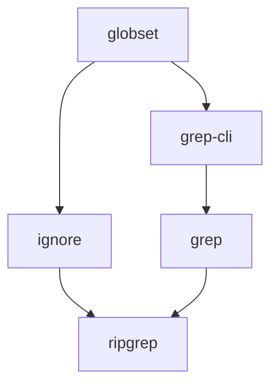
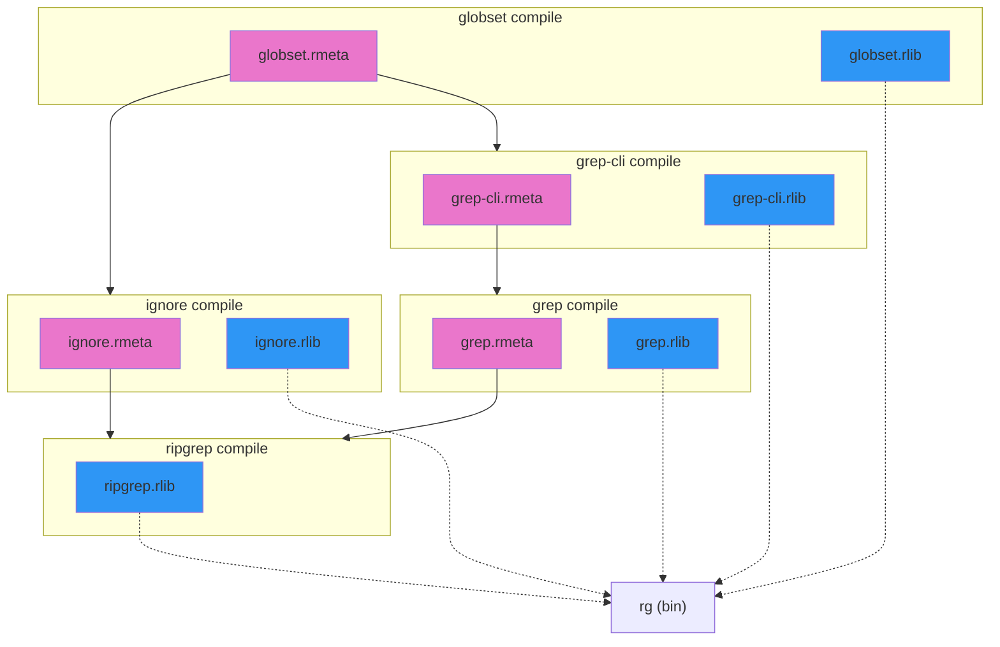
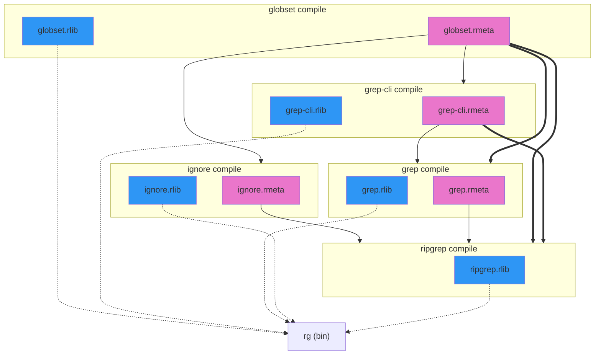

# Relink don't Rebuild
| Metadata         |                        |
| --------         | ---                    |
| Point of contact | @yaahc                 |
| Status           | Proposed               |
| Tracking issue   | |
| Zulip channel    | |

| [cargo] champion | @weihanglo |
| [compiler] champion | @oli-obk |
## Summary

Work towards avoiding rebuilds of a crate's dependents for changes that don't affect the crate's
public interface.

<!--Our end goal is to have some flags available on nightly that enable avoiding unnecessary rebuilds in certain cases. -->

<!--
Links:
  - https://github.com/rust-lang/compiler-team/issues/790
  - Piotr's cargo issue: https://github.com/rust-lang/cargo/issues/14604
    + branch: https://github.com/rust-lang/cargo/compare/master...osiewicz:cargo:api-fingerprinting
  - Piotr's rustc branch: https://github.com/rust-lang/rust/compare/master...osiewicz:rust:api-fingerprinting
-->

## Motivation

<!--*Begin with a few sentences summarizing the problem you are attacking and why it is important.*-->

Changing a comment, reordering use statements, adding a `dbg!` statement to a non-inlinable
function, formatting code, or moving item definitions from one impl block to another
identical one all cause rebuilds of reverse dependencies of that crate.

This clashes with users' intuition for what needs to be rebuilt when certain changes are made
and makes iterating more painful.

As a point of reference, in C and C++ – where there is a strict separation between interface
and implementation in the form of header files – equivalent changes would only cause a
rebuild of the translation unit whose source has been modified. For other units, existing
compiler outputs would be reused (and re-linked into the final binary).

Our goal is to work towards making `cargo` and `rustc` smarter about when they do or don't need to
rebuild dependent crates (reverse dependencies).

### The status quo

<!--*
Elaborate in more detail about the problem you are trying to solve. This section is making
the case for why this particular problem is worth prioritizing with project bandwidth. A
strong status quo section will (a) identify the target audience and (b) give specifics about
the problems they are facing today.

Sometimes it may be useful to start sketching out how you think those problems will be
addressed by your change, as well, though it's not necessary.
*-->

As an example, consider the [`rg` binary in the `ripgrep` package][rg].

[rg]: https://github.com/BurntSushi/ripgrep/blob/3b7fd442a6f3aa73f650e763d7cbb902c03d700e/Cargo.toml

Its crate dependency graph (narrowed to only include dependents of `globset`, a particular
crate in `ripgrep`'s Cargo workspace) looks like this:
```
❯ cargo tree --invert globset
globset v0.4.16
├── grep-cli v0.1.11
│   └── grep v0.3.2
│       └── ripgrep v14.1.1
└── ignore v0.4.23
    └── ripgrep v14.1.1
```



Consider a change that does not alter the interface of the `globset` crate (for example,
modifying a private item or changing a comment within `globset`'s source code).

Here is the output of `cargo build --timings` for an incremental build of `ripgrep` where only
such a change was made to `globset`:

<!--  -->

<p align="center">
  
</p>
In the above we see `globset` and all transitive "upstream" dependent crates (up to `ripgrep`)
being rebuilt.

_Ideally_, in this scenario, the transitive dependents of `globset` (that only depend on
`globset`'s "interface") would _not_ need to be rebuilt. This would allow us to skip the
`grep-cli`, `ignore`, `grep`, and `ripgrep` re-compiles and only redo linking of the final
binary ("relink, don't rebuild")[^caveat_linking].

[^caveat_linking]: `cargo --timings` output does not currently differentiate between time spent compiling (i.e. producing the `rlib` for) and linking the final binary (`rg`); the `rg` bar covers time spent for both

For smaller/shallow dep graphs (like the above) the extra rebuilds are tolerable, but for deeper
graphs, these rebuilds significantly impact edit-debug cycle times.

<!--
From original MCP: https://github.com/rust-lang/compiler-team/issues/790

> Over at Zed we've noticed that even seemingly innocent changes to the crate that has many
> dependents causes us to rebuild (almost) the whole world. Adding a `dbg!` statement to the
> body of non-inlineable function, formatting code, updating a dependency to a new minor
> version and such still forces us to rebuild all dependants of an affected crate.

see numbers from piotr's measurements as an example of the upper bound for potential speedup
-->

---

#### Transitive Deps and the Build System View

Ideally the crate-level dependency graph above would (morally) correspond to a build graph like
this[^caveat_pipelining]:



[^caveat_pipelining]:
    We have taken some liberties in the above graph w.r.t. pipelining.
    <br><br>
    Today, `cargo` preforms a single `rustc` invocation to produce the `rlib` and `rmeta`
    for each crate – `rmeta` is modeled as an "early out".
    <br><br>
    Additionally, producing `ripgrep.rlib` and linking (the `rg (bin)` node) happens as part
    of a single `rustc` invocation.

In particular, note that crate compiles use the `rmeta`s of their direct dependencies.

However, in reality crate compiles need access to all _transitive_ `rmeta`s:


This means that when a crate's `rmeta` changes, the `rustc` invocations corresponding to all
transitive dependents of that crate are rerun (even if intermediate `rmeta`s are the
same).

More concretely: when `globset.rmeta` changes, `grep` is rebuilt – even if `grep-cli.rmeta`
(after `grep-cli` is re-compiled) hasn't changed.

The fact that crate compiles depend on the `rmeta`s for all transitive dependencies is
significant because it inhibits our ability to get "early cutoff" (ECO). In reality, crates
compiles are only _actually_ sensitive to the subset of their transitive deps exposed via
their direct deps but under this view (file-level, in the eyes of the build system) crates are
sensitive to transitive dependencies in their entirety.

More concretely: the `grep` crate is only sensitive to the parts of `globset` accessible via
`grep_cli` – if a change is made to `globset` that doesn't affect this subset, we'd expect to
see `grep_cli` being rebuilt but the existing `grep` outputs being reused (no `grep` rebuild).

<div class="warning">

["Early cutoff" (ECO)][bsac] refers to a build system optimization where we are able to detect
that a freshly-built artifact is identical to a prior one and to then reuse existing
artifacts of dependent crates from then on (instead of continuing to rebuild them).

</div>

[bsac]: https://www.microsoft.com/en-us/research/wp-content/uploads/2020/04/build-systems-jfp.pdf

### The next 6 months

<!--*Sketch out the specific things you are trying to achieve in this goal period. This should be short and high-level -- we don't want to see the design!*-->

* Identify and remove "oversensitivity" in `.rmeta`
  - i.e. changes to spans, comments, etc. will not affect the `.rmeta`
  - coupled with cargo's unstable [`checksum-freshness` feature](https://github.com/rust-lang/cargo/issues/14136),
    this would avoid triggering rebuilds for dependent crates
* Make `DefId`s more stable when items are added or reordered
   - today this is a major source of differences in compiler output
   - there are other things like `SymbolIndex`es which we may also want to stabilize
* Work on designs for enabling "transitive" ECO
  - i.e. the decision to rebuild should factor in what parts of a transitive crate dep are
    accessible via direct deps

### The "shiny future" we are working towards

<!-- *If this goal is part of a larger plan that will extend beyond this goal period, sketch out the goal you are working towards. It may be worth adding some text about why these particular goals were chosen as the next logical step to focus on.* >

*This text is NORMATIVE, in the sense that teams should review this and make sure they are aligned. If not, then the shiny future should be moved to frequently asked questions with a title like "what might we do next".*-->

Only changes to a crate that affect the public interface of the crate should cause downstream
crates to rebuild.

<!--
## Design axioms

(NOTE: not including)

  - go after the common case (change private function body/change a comment/add private item)
  - incremental improvements? (i.e. cover more cases over time)
  - correctness/testability ((try to be as-or-more correct than rustc-incremental))
-->

## Ownership and team asks

<!--
**Owner:** *Identify a specific person or small group of people if possible, else the group that will provide the owner. Github user names are commonly used to remove ambiguity.*

*This section defines the specific work items that are planned and who is expected to do them. It should also include what will be needed from Rust teams. The table below shows some common sets of asks and work, but feel free to adjust it as needed. Every row in the table should either correspond to something done by a contributor or something asked of a team. For items done by a contributor, list the contributor, or ![Help wanted][] if you don't yet know who will do it. For things asked of teams, list ![Team][] and the name of the team. The things typically asked of teams are defined in the [Definitions](#definitions) section below.* -->

| Task                       | Owner(s) or team(s)     | Notes |
| ----------------------------- | ----------------------- | ----- |
| Design meeting | ![Team][] [compiler] |       |
| Discussion and moral support  | ![Team][] [compiler] ![Team][] [cargo]      |       |
| Nightly experiment for RDR  |                         |       |
| ↳ Author MCP                  | @osiewicz | [already accepted](https://github.com/rust-lang/compiler-team/issues/790)  |
| ↳ Rustc Implementation        | | [WIP](https://github.com/osiewicz/rust/tree/api-fingerprinting) |
| ↳ Cargo Implementation        | | [WIP](https://github.com/osiewicz/cargo/tree/api-fingerprinting) |
| Improve DefId stability       | @dropbear32 | |
| Standard reviews              | ![Team][] [compiler] [cargo]    |       |

### Definitions

Definitions for terms used above:

* *Discussion and moral support* is the lowest level offering, basically committing the team to nothing but good vibes and general support for this endeavor.
* *Design meeting* means holding a synchronous meeting to review a proposal and provide feedback (no decision expected).
* *Standard reviews* refers to reviews for PRs against the repository; these PRs are not expected to be unduly large or complicated.
* Other kinds of decisions:
    * Compiler [Major Change Proposal (MCP)](https://forge.rust-lang.org/compiler/mcp.html) is used to propose a 'larger than average' change and get feedback from the compiler team.

## Frequently asked questions

### Isn't `rustc` incremental enough?

Theoretically, yes: under a system like `rust-analyzer` where there isn't chunking of work along
crate/file/process invocation boundaries, incremental compilation would obviate this effort.

However under `rustc`'s current architecture (1 process invocation per crate, new process
invocation for each compile rather than a daemon): RDR (i.e. being able to skip `rustc`
invocations) still matters.

Right now even when 100% of a compile's incremental queries hit the cache (such as when you
`touch` a source file; i.e. [`incr-unchanged`](https://perf.rust-lang.org/)) it still takes
non-negligible amounts of time to replay those queries and re-emit compiler outputs (see
[zulip thread](https://rust-lang.zulipchat.com/#narrow/channel/131828-t-compiler/topic/rmeta.20stability/near/501691783)).
